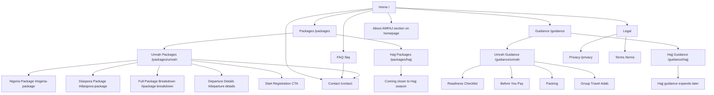
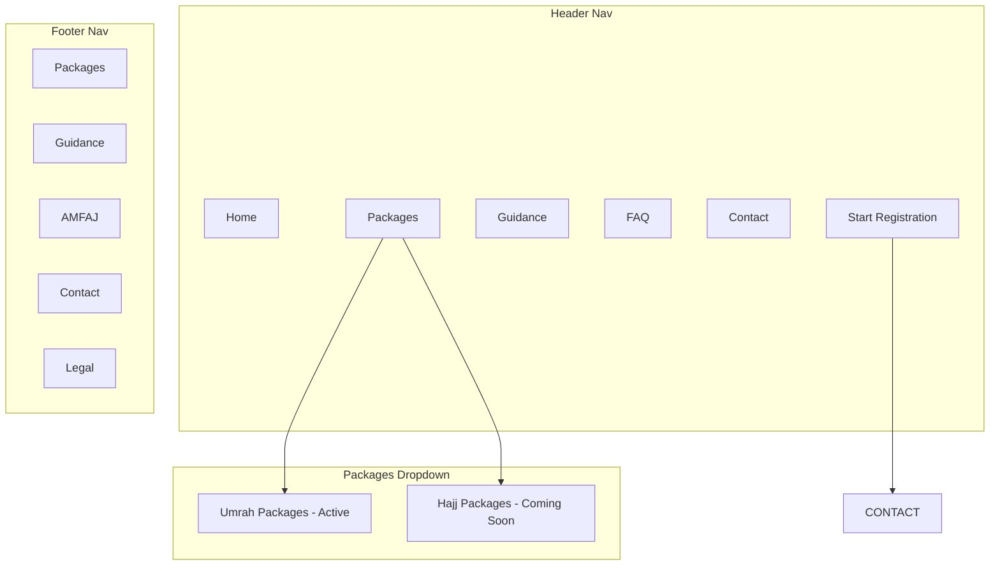

# AMFAJ Travels and Tours - Website Information Architecture and Sitemap

## Context Summary

Site type:

- Small business / religious travel service website with package inquiry, education, and WhatsApp-led conversion.

Current state:

- New site.
- No existing URLs to preserve or redirect.

Primary audiences:

- Muslims in Nigeria who love the Sunnah and want Umrah/Hajj support.
- Prospective September Umrah pilgrims.
- Diaspora Muslims and sponsors.
- Families planning Umrah for parents, spouses, or relatives.

Top site goals:

1. Introduce AMFAJ Travels and Tours clearly.
2. Convert visitors into September Umrah registration/inquiry conversations.
3. Make Umrah and Hajj package categories easy to understand, with Hajj inactive until closer to Hajj season.
4. Educate prospects through Guidance content grouped under Umrah and Hajj.

Primary CTAs:

- Start Registration.
- Browse Packages.

Secondary CTAs:

- Send "UMRAH" on WhatsApp.
- Ask for the full package breakdown.
- Ask about AMFAJ's scholar-led guidance.
- Discuss sponsorship.

## Architecture Principles

- Keep the MVP compressed and clear: Home, Packages, Guidance, FAQ, Contact, Legal.
- Home should introduce AMFAJ before selling, then immediately show the active Umrah package.
- Packages should be a category hub with two branches: Umrah and Hajj.
- Umrah is active now; Hajj is inactive/empty-state until AMFAJ is closer to Hajj season.
- Guidance should cover both Umrah and Hajj in one education hub, inspired by Nusuk's organized guidance approach.
- Scholar-led guidance is a universal AMFAJ value, not a separate package tier.
- WhatsApp remains the primary conversion path behind "Start Registration."
- Do not create complex booking/payment flows in the MVP.

## Page Hierarchy

```text
Homepage (/)
├── Packages (/packages)
│   ├── Umrah Packages (/packages/umrah)
│   │   ├── Nigeria Umrah Package (#nigeria-package)
│   │   ├── Diaspora Umrah Package (#diaspora-package)
│   │   ├── Full Package Breakdown (#package-breakdown)
│   │   ├── Departure Details (#departure-details)
│   │   └── Registration CTA (#registration)
│   └── Hajj Packages (/packages/hajj)
│       └── Empty State: Coming closer to Hajj season
├── Guidance (/guidance)
│   ├── Umrah Guidance (/guidance/umrah)
│   │   ├── Umrah Readiness Checklist (#readiness-checklist)
│   │   ├── Before You Pay For Umrah (#before-you-pay)
│   │   ├── What To Pack For Umrah (#packing)
│   │   └── Group Travel Adab (#group-adab)
│   └── Hajj Guidance (/guidance/hajj)
│       └── Empty/early guidance state until Hajj campaign begins
├── FAQ (/faq)
├── Contact (/contact)
└── Legal
    ├── Privacy Policy (/privacy)
    └── Terms and Conditions (/terms)
```

## MVP Page Set

Launch with:

- `/`
- `/packages`
- `/packages/umrah`
- `/packages/hajj`
- `/guidance`
- `/guidance/umrah`
- `/guidance/hajj`
- `/faq`
- `/contact`
- `/privacy`
- `/terms`

Do not launch separate `/about` or standalone `/hajj` pages in the MVP. "About AMFAJ" should be a strong homepage section after the Umrah package breakdown. Hajj should live under Packages and Guidance until the Hajj campaign is active.

## Visual Sitemap



## Navigation Zone Map



## URL Map

| Page | URL | Parent | Nav Location | Priority | Purpose |
| --- | --- | --- | --- | --- | --- |
| Home | `/` | - | Header | High | Introduce AMFAJ, show active Umrah package, and drive registration. |
| Packages | `/packages` | Home | Header | High | Category hub for Umrah and Hajj packages. |
| Umrah Packages | `/packages/umrah` | Packages | Header dropdown | High | Main commercial page for the September Umrah package. |
| Hajj Packages | `/packages/hajj` | Packages | Header dropdown | Medium | Inactive/empty-state page until Hajj campaign begins. |
| Guidance | `/guidance` | Home | Header | Medium | Education hub grouped into Umrah and Hajj guidance. |
| Umrah Guidance | `/guidance/umrah` | Guidance | Guidance hub | Medium | Umrah preparation resources and checklist content. |
| Hajj Guidance | `/guidance/hajj` | Guidance | Guidance hub | Low-Medium | Early/inactive Hajj guidance section until campaign begins. |
| FAQ | `/faq` | Home | Header/Footer | High | Answer package, registration, guidance, date, inclusion, and WhatsApp questions. |
| Contact | `/contact` | Home | Header/Footer | High | Push serious visitors to WhatsApp and inquiry prompts. |
| Privacy Policy | `/privacy` | Legal | Footer | Medium | Trust/compliance page. |
| Terms and Conditions | `/terms` | Legal | Footer | Medium | Terms/commercial clarity. |

## Header Navigation Spec

Recommended header order:

1. Home
2. Packages
3. Guidance
4. FAQ
5. Contact
6. CTA button: Start Registration

Header CTA behavior:

- "Start Registration" should open WhatsApp with a prefilled message or lead to the registration section on `/packages/umrah`.
- Secondary hero CTA should be "Browse Packages."

Packages dropdown:

- Umrah Packages: Active.
- Hajj Packages: Coming Soon / inactive state.

Guidance dropdown or hub:

- Umrah Guidance.
- Hajj Guidance.

## Footer Navigation Spec

Footer column: Packages

- Browse Packages
- Umrah Packages
- Hajj Packages - Coming Soon

Footer column: Guidance

- Guidance Hub
- Umrah Guidance
- Hajj Guidance
- Umrah Readiness Checklist
- Sponsor Umrah

Footer column: AMFAJ

- About AMFAJ section
- Our Promise
- Scholar-Led Guidance Standard
- FAQ

Footer column: Contact

- WhatsApp
- Instagram
- Facebook
- TikTok
- Departure: Lagos and Abuja

Footer column: Legal

- Privacy Policy
- Terms and Conditions

## Breadcrumb Rules

Use breadcrumbs on all pages except the homepage.

Examples:

- Home > Packages
- Home > Packages > Umrah
- Home > Packages > Hajj
- Home > Guidance
- Home > Guidance > Umrah
- Home > Guidance > Hajj
- Home > FAQ
- Home > Contact

## Page-Level Section Architecture

### Home

Primary job:

Introduce AMFAJ, then move quickly into the active Umrah package and registration CTA.

Recommended section order:

1. Hero introduction: AMFAJ Travels and Tours.
2. Primary CTA: Start Registration.
3. Secondary CTA: Browse Packages.
4. Active Umrah package preview.
5. Split package cards: Nigeria and Diaspora.
6. Comprehensive Umrah package breakdown.
7. About AMFAJ section.
8. Universal scholar-led guidance standard.
9. FAQ preview.
10. Final CTA.
11. Footer.

### Packages

Primary job:

Let visitors choose between Umrah and Hajj packages.

Recommended sections:

1. Packages intro.
2. Umrah card: Active, with September package summary.
3. Hajj card: Coming soon / inactive empty state.
4. CTA to Umrah package.
5. FAQ preview.

### Umrah Packages

Primary job:

Explain the active Umrah package and convert visitors to registration/inquiry.

Recommended sections:

1. Package hero.
2. Fast facts strip.
3. Nigeria package card.
4. Diaspora package card.
5. Comprehensive package breakdown.
6. Departure and arrival details.
7. Universal scholar-led guidance standard.
8. What to prepare before registration.
9. FAQ.
10. Start Registration CTA.

### Hajj Packages

Primary job:

Represent Hajj professionally without pretending Hajj packages are available.

Recommended empty-state sections:

1. Hajj Packages.
2. Message: "Hajj packages are not active yet. AMFAJ will open Hajj details closer to the season, In Sha Allah."
3. CTA: Join Hajj Interest List.
4. Link: Explore Hajj Guidance.
5. Link: Browse active Umrah package.

### Guidance

Primary job:

Group Umrah and Hajj education under one clear guidance hub.

Recommended sections:

1. Guidance intro.
2. Umrah Guidance card.
3. Hajj Guidance card.
4. Featured preparation resources.
5. CTA to active Umrah package.

### Umrah Guidance

Recommended sections:

1. Umrah readiness checklist.
2. Before you pay.
3. What to pack.
4. Group travel adab.
5. Sponsor an Umrah journey.
6. CTA to Umrah package.

### Hajj Guidance

Recommended sections:

1. Hajj guidance intro.
2. Empty/early state: "Hajj guidance will expand as AMFAJ approaches the Hajj season."
3. Basic preparation reminders if approved.
4. CTA: Join Hajj Interest List.

### FAQ

FAQ clusters:

- AMFAJ.
- Packages.
- Umrah package.
- Hajj empty state.
- Registration.
- Scholar-led guidance.
- Sponsorship.
- Visa/inclusion wording.

### Contact

Recommended sections:

1. WhatsApp CTA.
2. Suggested WhatsApp message: "Assalamu alaykum, I want to start registration for AMFAJ September Umrah."
3. Package inquiry prompts.
4. Social links.
5. Future lead form.

## Internal Linking Plan

- Home hero "Browse Packages" links to `/packages`.
- Home package preview links to `/packages/umrah`.
- Packages page Umrah card links to `/packages/umrah`.
- Packages page Hajj card links to `/packages/hajj`.
- Hajj empty state links to `/guidance/hajj`.
- Guidance Umrah content links to `/packages/umrah`.
- FAQ package answers link to `/packages/umrah`.
- FAQ Hajj answers link to `/packages/hajj`.
- Contact page links back to `/packages/umrah` and `/faq`.

## SEO Content Clusters

Cluster: Packages

- `/packages`
- `/packages/umrah`
- `/packages/hajj`

Cluster: Guidance

- `/guidance`
- `/guidance/umrah`
- `/guidance/hajj`

## Launch Checklist

- Header uses Home, Packages, Guidance, FAQ, Contact, Start Registration.
- Packages dropdown contains Umrah active and Hajj coming soon.
- Home introduces AMFAJ before package cards.
- Home includes active Umrah package immediately after hero.
- Umrah page includes Nigeria and Diaspora package split.
- Hajj packages page uses inactive empty state.
- Guidance groups both Umrah and Hajj.
- No standalone Hajj page outside Packages/Guidance.
- No standalone About page in MVP.
- Every commercial path has WhatsApp or registration CTA.
- Package facts match `package_direction.md`.
